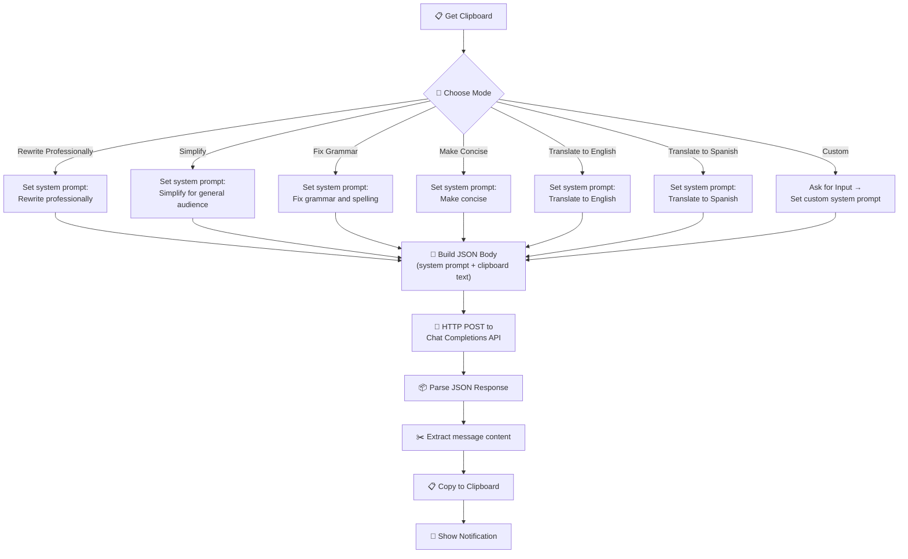

# Clipboard Rewriter

A provider-agnostic iOS Shortcut that grabs text from your clipboard, transforms it using an LLM with a user-selected rewriting mode, and replaces the clipboard with the result. One tap, any provider, multiple writing styles.

## Why It Exists

You copy text constantly — emails, messages, notes, social media posts, documents. Often that text needs adjustment before you use it: it's too verbose, too casual, has grammar issues, or needs to be in another language. Opening a ChatGPT app, pasting, typing a prompt, waiting, copying the output, and switching back is a multi-step interruption.

This shortcut turns text transformation into a **copy-transform-paste** workflow. Copy the text, tap the shortcut, pick a mode, and the improved version is already on your clipboard ready to paste — all without leaving whatever app you're in.

## User-Facing Behavior

1. **Copy** any text to your clipboard in any app
2. **Tap** the shortcut from your Home Screen, widget, or via Siri
3. **Choose** a rewriting mode from the menu (Professional, Simplify, Grammar, Concise, Translate, or Custom)
4. **Wait** 1-3 seconds while the LLM processes your text
5. **Paste** — the rewritten text is already on your clipboard
6. **Confirmation** — a notification tells you the rewrite is complete and which mode was used

### Real-World Examples

- **Polishing a Slack message**: Copy a casual message, tap "Rewrite Professionally", paste a polished version into the #leadership channel
- **Simplifying jargon**: Copy a dense technical paragraph from a research paper, tap "Simplify", paste a plain-English version into your notes
- **Fixing a quick email**: Copy a draft with typos, tap "Fix Grammar", paste the corrected version
- **Trimming a bio**: Copy a 200-word bio, tap "Make Concise", get a tight 80-word version
- **Translating a customer message**: Copy a Spanish customer support email, tap "Translate to English", paste the translation into your CRM
- **Custom prompts**: Copy any text, tap "Custom", type your own instruction like "Make this sound more enthusiastic" or "Convert to bullet points"

## Internal Flow



### Step-by-Step Breakdown

| Step | Shortcut Action | What It Does |
|------|----------------|--------------|
| 1 | **Get Clipboard** | Reads the current text content from the system clipboard |
| 2 | **Set Variable** | Stores the clipboard text in a variable for later use |
| 3 | **Choose from Menu** | Presents the user with 7 rewriting modes to pick from |
| 4 | **Text** (per mode) | Sets the system prompt based on the selected mode |
| 5 | **Ask for Input** (Custom only) | If "Custom" is selected, prompts the user to type a custom instruction |
| 6 | **Text** | Constructs the JSON request body with the system prompt and clipboard text |
| 7 | **Get Contents of URL** | Sends an HTTP POST request with the JSON body to the configured chat completions endpoint |
| 8 | **Get Dictionary Value** | Parses the JSON response to extract `choices` |
| 9 | **Get Dictionary Value** | Gets the first item from the choices array |
| 10 | **Get Dictionary Value** | Extracts the `message` object |
| 11 | **Get Dictionary Value** | Extracts the `content` string (the rewritten text) |
| 12 | **Copy to Clipboard** | Replaces the clipboard with the rewritten text |
| 13 | **Show Notification** | Displays a banner notification confirming the rewrite is complete |

## Inputs

| Input | Type | Description |
|-------|------|-------------|
| Clipboard | Text | The text currently on the system clipboard, to be rewritten |
| Mode | Menu selection | The user's chosen rewriting style (one of 7 options) |
| Custom instruction | Text (optional) | A user-typed prompt, only when "Custom" mode is selected |

## Outputs

| Output | Type | Description |
|--------|------|-------------|
| Clipboard | Text | The rewritten/transformed text, ready to paste into any app |
| Notification | Banner | Confirmation that the rewrite completed and which mode was used |

## Permissions Required

| Permission | Why |
|-----------|-----|
| **Clipboard** | To read the original text and write the transformed result (auto-granted in Shortcuts) |
| **Network** | To send the text to the LLM endpoint and receive the response |
| **Notifications** | To display the completion banner |

## Setup

### 1. Choose a Provider

This shortcut works with any OpenAI-compatible chat completions endpoint. The request format follows the `/v1/chat/completions` standard, which is supported by most LLM providers and local inference servers.

| Provider | Endpoint | Model Examples | Latency | Cost | Notes |
|----------|----------|---------------|---------|------|-------|
| **OpenAI** | `https://api.openai.com/v1/chat/completions` | `gpt-4o`, `gpt-4o-mini` | ~1-3s | $2.50-$10/1M tokens | Best overall quality, widely used |
| **Anthropic (via proxy)** | `https://openrouter.ai/api/v1/chat/completions` | `anthropic/claude-sonnet-4` | ~1-3s | $3/1M tokens | Use OpenRouter for OpenAI-compatible format |
| **Groq** | `https://api.groq.com/openai/v1/chat/completions` | `llama-3.3-70b-versatile` | ~0.3-1s | Free tier available | Fastest inference, great for quick rewrites |
| **Local (Ollama/LM Studio)** | `http://your-server:11434/v1/chat/completions` | `llama3`, `mistral` | Varies | Free (self-hosted) | Full privacy, no data leaves your network |

### 2. Get an API Key

Sign up with your chosen provider and generate an API key:

- **OpenAI**: [platform.openai.com/api-keys](https://platform.openai.com/api-keys)
- **Groq**: [console.groq.com/keys](https://console.groq.com/keys)
- **OpenRouter** (for Anthropic/others): [openrouter.ai/keys](https://openrouter.ai/keys)
- **Local**: No API key needed (use any placeholder value)

### 3. Install the Shortcut

Download and install the shortcut on your iOS device:

**[Install Clipboard Rewriter](clipboard-rewriter.shortcut)**

> After installing, iOS will prompt you to configure three settings: your API endpoint, API key, and model name. Fill these in based on your chosen provider.

### 4. Configure

When you install the shortcut, iOS will ask you three import questions:

1. **API Endpoint URL** -- Paste your provider's chat completions endpoint
2. **API Key** -- Paste your API key (stored locally, never shared beyond your chosen endpoint)
3. **Model** -- Enter the model name (e.g., `gpt-4o`, `llama-3.3-70b-versatile`)

### 5. Test It

Copy some text, tap the shortcut, choose "Fix Grammar", and paste. If the corrected text appears, you're all set!

## Configuration Options

| Option | Default | Description |
|--------|---------|-------------|
| `ENDPOINT_URL` | *(must set)* | The OpenAI-compatible chat completions endpoint |
| `API_KEY` | *(must set)* | Bearer token for authentication |
| `MODEL` | `gpt-4o-mini` | Model identifier (provider-dependent) |

## Example API Interactions

### Request (all providers use the same format)

```
POST /v1/chat/completions
Authorization: Bearer sk-your-api-key
Content-Type: application/json

{
  "model": "gpt-4o-mini",
  "messages": [
    {
      "role": "system",
      "content": "You are a writing assistant. Rewrite the following text in a professional tone suitable for business communication. Preserve the original meaning and key information. Return only the rewritten text, no explanations."
    },
    {
      "role": "user",
      "content": "hey just wanted to let u know the meeting got pushed to 3pm tmrw, also can u bring the quarterly numbers? thx"
    }
  ]
}
```

### Response

```json
{
  "id": "chatcmpl-abc123",
  "object": "chat.completion",
  "choices": [
    {
      "index": 0,
      "message": {
        "role": "assistant",
        "content": "I wanted to inform you that tomorrow's meeting has been rescheduled to 3:00 PM. Could you please bring the quarterly figures? Thank you."
      },
      "finish_reason": "stop"
    }
  ],
  "usage": {
    "prompt_tokens": 65,
    "completion_tokens": 32,
    "total_tokens": 97
  }
}
```

The shortcut extracts: `choices` -> first item -> `message` -> `content`.

### Example Transformations by Mode

| Mode | Input | Output |
|------|-------|--------|
| **Rewrite Professionally** | "hey can we push the deadline? things r taking longer than expected" | "I'd like to request a deadline extension, as the current timeline has proven more demanding than initially anticipated." |
| **Simplify** | "The implementation leverages a microservices architecture to facilitate horizontal scalability" | "The system uses small, separate services so it can handle more users easily." |
| **Fix Grammar** | "Their going to there house over they're" | "They're going to their house over there." |
| **Make Concise** | "I wanted to reach out to you to let you know that at this point in time we are not able to move forward with the project" | "We're unable to proceed with the project at this time." |
| **Translate to English** | "Bonjour, je voudrais reserver une table pour deux personnes" | "Hello, I would like to reserve a table for two people." |

## Privacy Notes

- **Your clipboard text leaves your device** and is sent to whichever LLM endpoint you configure. It is **not** processed on-device.
- Your **API key is stored locally** inside the shortcut on your device. It is only transmitted to the endpoint you configure.
- **No telemetry** -- the shortcut does not phone home or send data anywhere beyond your chosen provider.
- **No storage** -- the shortcut does not save your text. Input and output exist only in memory during the API request.
- If you use a **local LLM server** (Ollama, LM Studio, etc.), your text never leaves your network -- full privacy.
- **Sensitive text warning**: Do not use this shortcut with passwords, private keys, medical records, or other highly sensitive data unless you are using a local provider or have reviewed your provider's data retention policy.
- Review your provider's data retention and training policies to understand how they handle your input text.

## Known Limitations

- **Text only**: The shortcut reads plain text from the clipboard. Images, rich text formatting, and files are not supported.
- **No streaming**: The shortcut waits for the full response before updating the clipboard. There is no incremental output.
- **Clipboard length**: Very long texts (10,000+ words) may hit the provider's context window limit or cause timeout issues.
- **Token costs**: Each rewrite consumes API tokens. Frequent use with large texts on paid tiers can add up.
- **No undo**: Once the clipboard is replaced, the original text is gone. Copy the original somewhere safe first if you need to keep it.
- **Custom mode is freeform**: The Custom mode relies on the user typing a good prompt. Vague instructions may produce unexpected results.
- **Translation quality**: Translation modes work well for common languages but may struggle with specialized terminology or low-resource languages.
- **Formatting loss**: The LLM may alter formatting (bullet points, numbered lists, indentation) in its output.

## Troubleshooting

| Problem | Likely Cause | Solution |
|---------|-------------|----------|
| "Could not connect to the server" | Wrong endpoint URL or no internet | Double-check the URL matches your provider's chat completions endpoint. Test it in Safari. |
| Empty clipboard after running | Response parsing failed | The response shape may differ from expected. Add a "Quick Look" action before "Copy to Clipboard" to inspect the raw response. |
| "401 Unauthorized" | Invalid or expired API key | Regenerate your API key and update the shortcut's configuration. |
| Rewritten text is identical to input | System prompt issue or model confusion | Try a different mode. Check that the model name is correct for your provider. |
| "The request timed out" | Text too long or slow endpoint | Try shorter text. Switch to a faster provider like Groq. |
| Garbled or unexpected output | Wrong model name | Verify the model name matches what your provider supports (e.g., `gpt-4o-mini` for OpenAI, `llama-3.3-70b-versatile` for Groq). |
| Notification doesn't appear | iOS notification settings | Go to Settings > Notifications > Shortcuts and ensure notifications are enabled. |
| "No text on clipboard" feeling | Clipboard had an image or file, not text | Make sure you copied plain text, not an image or file reference. |
