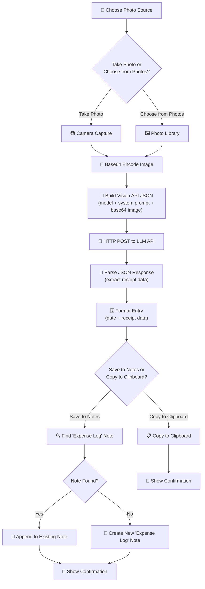

# Receipt Scanner

An iOS Shortcut that photographs a receipt (or selects one from your photo library), sends it to an LLM vision API for structured extraction, and saves the parsed data to an "Expense Log" note in Apple Notes or copies it to your clipboard. One snap, instant expense tracking, permanent record.

## Why It Exists

Receipts pile up in pockets, wallets, and desk drawers. You mean to log them for expense reports, budgets, or tax records, but manually typing line items is tedious. By the time you get around to it, the thermal ink has faded or the receipt is lost. What you actually need is a way to capture receipt data the moment you get it, structured and searchable, without any manual data entry.

This shortcut turns your iPhone camera into an expense-tracking tool. Snap a photo of a receipt (or pick one from your gallery), and within seconds you have a structured breakdown of the store, items, prices, tax, total, and payment method, ready to save or share.

## User-Facing Behavior

1. **Tap** — run the shortcut and choose "Take Photo" or "Choose from Photos"
2. **Snap** — photograph the receipt or select an existing photo
3. **Wait** — the shortcut encodes the image, sends it to your configured vision LLM, and receives structured receipt data (usually 3-8 seconds)
4. **Save** — choose to save the parsed data to Apple Notes ("Expense Log") or copy it to your clipboard
5. **Done** — a notification confirms the action

### Real-World Examples

- **Daily expenses**: Grab lunch, snap the receipt before tossing it, and your Expense Log has every line item and the total within seconds.
- **Business travel**: Photograph hotel, taxi, and meal receipts as you go. Your Expense Log becomes a ready-made expense report.
- **Tax season**: Scan receipts for deductible purchases throughout the year. When tax time comes, your Expense Log has every item itemized with dates and amounts.
- **Shared expenses**: Scan a restaurant receipt and copy the structured data to a group chat so everyone can see what they owe.
- **Budget tracking**: Over time, your Expense Log becomes a searchable spending history. Scroll through to spot patterns and find specific purchases.

## Internal Flow



### Step-by-Step Breakdown

| Step | Shortcut Action | What It Does |
|------|----------------|--------------|
| 1 | **Choose from Menu** | Presents a menu to take a new photo or select from the photo library |
| 2 | **Take Photo / Select Photo** | Captures or selects the receipt image |
| 3 | **Set Variable** | Stores the receipt photo in a variable |
| 4 | **Text** (endpoint) | Defines the LLM API endpoint URL |
| 5 | **Text** (API key) | Defines the API key for authentication |
| 6 | **Text** (model) | Defines the model name to use |
| 7 | **Base64 Encode** | Converts the receipt image to a base64 string for the vision API |
| 8 | **Text** (JSON body) | Builds the JSON request body with the model, system prompt, and base64 image |
| 9 | **Get Contents of URL** (POST) | Sends the vision request to the LLM API with authorization headers |
| 10 | **Get Dictionary Value** (x3) | Parses the JSON response: `choices` -> first item -> `message` -> `content` |
| 11 | **Date** | Gets the current date for the entry timestamp |
| 12 | **Text** (format entry) | Combines the date and extracted receipt data into a formatted entry |
| 13 | **Choose from Menu** | Asks the user to save to Notes or copy to clipboard |
| 14 | **Find Notes / If / Append or Create** | Finds the "Expense Log" note and appends, or creates a new one |
| 15 | **Copy to Clipboard** | Alternatively copies the formatted entry to the clipboard |
| 16 | **Show Notification** | Displays a confirmation banner |

## Inputs

| Input | Type | Source | Description |
|-------|------|--------|-------------|
| Receipt photo | Image | Camera or Photo Library | A photograph of a receipt to analyze |

## Outputs

| Output | Type | Destination | Description |
|--------|------|-------------|-------------|
| Expense Log entry | Rich text | Apple Notes | A formatted entry appended to the "Expense Log" note, containing date, store, items, prices, tax, total, and payment method |
| Clipboard text | Plain text | Clipboard | The same formatted entry, if the user chooses to copy instead of saving |
| Notification | Banner | iOS notification | A brief confirmation that the receipt was processed |

## Permissions Required

| Permission | Why |
|-----------|-----|
| **Camera** | To take a photo of a receipt |
| **Photos** | To select an existing receipt photo from the library |
| **Network** | To send the base64-encoded image to the LLM vision API |
| **Notes** | To find, create, and append to the "Expense Log" note in Apple Notes |
| **Notifications** | To show a confirmation banner when processing is complete |

## Setup

### 1. Choose an LLM Provider

This shortcut requires a vision-capable LLM. It works with any OpenAI-compatible vision API. Here are tested providers:

| Provider | Endpoint | Model | Latency | Cost | Notes |
|----------|----------|-------|---------|------|-------|
| **OpenAI** | `https://api.openai.com/v1/chat/completions` | `gpt-4o-mini` | ~3-6s | ~$0.15/1M input tokens | Best balance of quality and cost, supports vision |
| **OpenAI** | `https://api.openai.com/v1/chat/completions` | `gpt-4o` | ~4-8s | ~$2.50/1M input tokens | Highest quality extraction |
| **Local (Ollama)** | `http://your-server:11434/v1/chat/completions` | `llava` | Varies | Free (self-hosted) | Full privacy, requires running a server with a vision model |

### 2. Get an API Key

Sign up with your chosen provider and generate an API key:

- **OpenAI**: [platform.openai.com/api-keys](https://platform.openai.com/api-keys)

### 3. Install the Shortcut

Download and install the shortcut on your iOS device:

**[Install Receipt Scanner](receipt-scanner.shortcut)**

> After installing, iOS will prompt you to review the shortcut's actions and ask three setup questions (endpoint URL, API key, model name). Fill these in and tap "Add Shortcut."

### 4. Configure on Import

When you install the shortcut, iOS will ask you three questions:

1. **LLM API Endpoint URL** — Paste your provider's chat completions endpoint (e.g., `https://api.openai.com/v1/chat/completions`)
2. **API Key** — Paste your API key (stored locally inside the shortcut, never shared beyond your chosen endpoint)
3. **Model Name** — Enter the model to use (e.g., `gpt-4o-mini`, `gpt-4o`)

### 5. Test It

Run the shortcut, take a photo of any receipt, and wait a few seconds. Open Apple Notes and look for a note titled "Expense Log" — your first entry should be there with the store name, itemized list, and total.

## Configuration Options

| Option | Default | Description |
|--------|---------|-------------|
| `ENDPOINT_URL` | `https://api.openai.com/v1/chat/completions` | The LLM API endpoint for vision chat completions |
| `API_KEY` | *(must set)* | Bearer token for API authentication |
| `MODEL` | `gpt-4o-mini` | Model identifier sent to the API (must support vision) |
| Note title | `Expense Log` | The Apple Notes note to append entries to |
| System prompt | Built-in | The prompt instructing the LLM what to extract from receipts (editable in the shortcut) |

## Example Expense Log

After several scans, your "Expense Log" note in Apple Notes looks like this:

```
🧾 Expense Log
═══════════════════════════════════════

───────────────────────────────────────
🧾 Scanned: 2026-03-15 12:30 PM

🏪 Store: Whole Foods Market
📅 Date: 03/15/2026

📋 Items:
  • Organic Bananas — $1.99
  • Sourdough Bread — $4.49
  • Almond Milk — $3.79
  • Mixed Greens — $5.99

💰 Subtotal: $16.26
📊 Tax: $0.81
✅ Total: $17.07
💳 Payment: Visa ending in 4532

═══════════════════════════════════════

───────────────────────────────────────
🧾 Scanned: 2026-03-15 7:45 PM

🏪 Store: Shell Gas Station
📅 Date: 03/15/2026

📋 Items:
  • Regular Unleaded (12.5 gal) — $47.50

💰 Subtotal: $47.50
📊 Tax: N/A
✅ Total: $47.50
💳 Payment: Apple Pay

═══════════════════════════════════════
```

## Example API Interaction

### OpenAI Vision API

**Request:**
```
POST /v1/chat/completions
Authorization: Bearer sk-your-api-key
Content-Type: application/json

{
  "model": "gpt-4o-mini",
  "messages": [
    {
      "role": "system",
      "content": "You are a receipt analysis assistant. Extract the following information..."
    },
    {
      "role": "user",
      "content": [
        {"type": "text", "text": "Analyze this receipt image and extract all information."},
        {"type": "image_url", "image_url": {"url": "data:image/jpeg;base64,/9j/4AAQ..."}}
      ]
    }
  ],
  "max_tokens": 1000
}
```

**Response:**
```json
{
  "choices": [
    {
      "message": {
        "content": "🏪 Store: Whole Foods Market\n📅 Date: 03/15/2026\n\n📋 Items:\n  • Organic Bananas — $1.99\n  • Sourdough Bread — $4.49\n\n💰 Subtotal: $6.48\n📊 Tax: $0.32\n✅ Total: $6.80\n💳 Payment: Visa ending in 4532"
      }
    }
  ]
}
```

The shortcut extracts `choices` -> first item -> `message` -> `content`.

## Privacy Notes

- **Receipt images leave your device** and are sent (as base64-encoded data) to whichever LLM API endpoint you configure. The full image is included in the request.
- Your **API key is stored locally** inside the shortcut on your device. It is only transmitted to the endpoint you configure.
- **Extracted data is stored in Apple Notes** on your device (and synced via iCloud if you have iCloud Notes enabled).
- **No telemetry** — the shortcut does not phone home or send data anywhere beyond your chosen LLM provider.
- **No photos are stored by the shortcut** — only the extracted text is saved. The base64-encoded image is used transiently for the API call.
- If you use a **local LLM** (e.g., Ollama with LLaVA on your home network), no data leaves your network.
- Review your LLM provider's data retention policy to understand how they handle images and completions.

## Known Limitations

- **Image quality matters**: Blurry, dark, or crumpled receipts may produce incomplete or incorrect extractions. Take photos in good lighting with the receipt flat.
- **Thermal receipt fading**: Old thermal receipts with faded ink may be unreadable even to vision models.
- **Token limits**: Very long receipts with many items may produce large base64 strings. Most vision models handle standard receipt images without issues.
- **Rate limits**: If you scan many receipts in rapid succession, you may hit your LLM provider's rate limits.
- **Non-English receipts**: The system prompt is in English and asks for English output. Receipts in other languages may produce mixed-language results.
- **Handwritten receipts**: The model works best with printed receipts. Handwritten receipts may have lower accuracy.
- **Single note**: All entries go to a single "Expense Log" note. Over months, this note can become very long. Consider periodically archiving old entries.
- **No offline mode**: The shortcut requires an internet connection to call the LLM vision API.

## Troubleshooting

| Problem | Likely Cause | Solution |
|---------|-------------|----------|
| "Could not connect to the server" | Wrong LLM endpoint URL or no internet | Double-check the endpoint URL. Try opening it in Safari to verify connectivity. |
| Empty or garbled receipt data | Poor image quality or unsupported model | Retake the photo in better lighting. Ensure your model supports vision (e.g., gpt-4o-mini, gpt-4o). |
| "401 Unauthorized" error | Invalid or expired API key | Regenerate your API key and update it in the shortcut (edit the API key text block). |
| "Expense Log" note not created | Notes permission not granted | When the shortcut runs for the first time, iOS should ask for Notes access. If denied, go to Settings > Privacy > Notes and enable access for Shortcuts. |
| Shortcut takes very long (>15s) | Large image or slow LLM endpoint | Try compressing the image or using a faster model. Large high-resolution photos take longer to encode and process. |
| Multiple "Expense Log" notes created | Existing note title does not exactly match | Ensure your note is titled exactly "Expense Log" (case-sensitive). |
| Notification does not appear | Notification permissions not granted | Go to Settings > Notifications > Shortcuts and enable notifications. |
| Camera not opening | Camera permission not granted | Go to Settings > Privacy > Camera and enable access for Shortcuts. |
