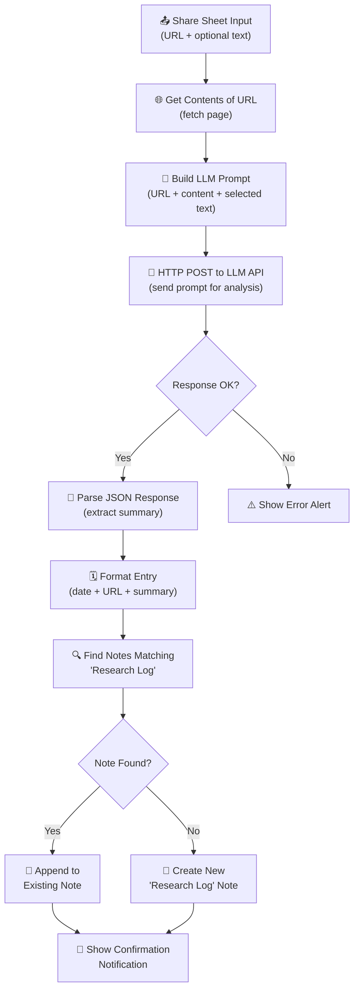

# Quick Research Capture

A share-sheet-powered iOS Shortcut that takes any URL, fetches its content, sends it to an LLM for analysis, and appends a structured summary to a running "Research Log" note in Apple Notes. One share, instant insight, permanent record.

## Why It Exists

You come across interesting articles, tweet threads, blog posts, and research papers throughout the day. You want to save them — but bookmarks pile up unread, and "read later" apps become graveyards. What you actually need is a way to capture the *essence* of what you found, why it matters, and what to explore next, without breaking your flow.

This shortcut turns the Share Sheet into a personal research assistant. Share a URL from Safari, Twitter, Reddit, or any app, and within seconds you have a dated, structured summary appended to a single note that grows into your personal knowledge base. No app switching, no manual summarization, no forgotten bookmarks.

## User-Facing Behavior

1. **Share** — tap the Share button in Safari (or any app) and select "Quick Research Capture" from the Share Sheet
2. **Wait** — the shortcut fetches the page content, sends it to your configured LLM, and receives a structured analysis (usually 3-8 seconds)
3. **Done** — a notification confirms the capture, and your "Research Log" note in Apple Notes now has a new entry with the date, source URL, summary, key takeaways, significance, and suggested related topics

### Real-World Examples

- **Saving articles**: You find a long-form piece on climate policy in Safari. Share it, and 5 seconds later your Research Log has a concise summary, three key takeaways, a note on why it matters, and suggestions for related reading.
- **Capturing tweet threads**: Someone posts a 20-tweet thread on distributed systems. Share the thread URL, and the shortcut distills it into a structured entry you can reference later.
- **Bookmarking with context**: Instead of a bare URL in your bookmarks bar that you will never revisit, you get a dated entry that tells you *what* the page said and *why* you saved it — even months later.
- **Building a reading habit**: Over time, your Research Log becomes a personal knowledge base. Scroll through it to see patterns in what you read, rediscover forgotten insights, and find connections between topics.
- **Research projects**: Working on a paper or presentation? Share every source you find. Your Research Log becomes an annotated bibliography that practically writes itself.

## Internal Flow



### Step-by-Step Breakdown

| Step | Shortcut Action | What It Does |
|------|----------------|--------------|
| 1 | **Receive Share Sheet Input** | Accepts a URL (and optionally selected text) from the Share Sheet when triggered from Safari or any app |
| 2 | **Set Variable** | Stores the shared URL in a variable for later use |
| 3 | **Get Contents of URL** | Fetches the full HTML/text content of the shared web page |
| 4 | **Set Variable** | Stores the fetched page content in a variable |
| 5 | **Text** (prompt) | Builds a detailed LLM prompt combining the URL, page content, and any selected text, asking for a summary, key takeaways, significance, and related topics |
| 6 | **Dictionary** (JSON body) | Constructs the JSON request body with the model name, prompt, and parameters |
| 7 | **Get Contents of URL** (POST) | Sends the prompt to your configured LLM API endpoint with the API key in the Authorization header |
| 8 | **Get Dictionary Value** | Parses the JSON response and extracts the LLM's analysis text |
| 9 | **Date** | Gets the current date and time for the entry timestamp |
| 10 | **Text** (format entry) | Combines the date, source URL, and LLM summary into a formatted Research Log entry |
| 11 | **Find Notes** | Searches Apple Notes for a note titled "Research Log" |
| 12 | **Count** | Counts matching notes to determine if the Research Log exists |
| 13 | **If / Otherwise** | If the note exists, appends the new entry; otherwise, creates a new "Research Log" note with the entry |
| 14 | **Show Notification** | Displays a confirmation banner: "Research captured!" |

### How the Share Sheet Integration Works

When you install this shortcut, iOS registers it as a Share Sheet extension that accepts URLs. Here is how the integration works:

1. **Registration**: The shortcut declares `WFWorkflowTypes` including `"ActionExtension"`, which tells iOS to show it in the Share Sheet. It also declares `WFWorkflowInputContentItemClasses` with URL and web page content types, so iOS knows to offer this shortcut when sharing links.

2. **Triggering**: When you tap Share in Safari (or any app that shares URLs), iOS shows the Share Sheet. "Quick Research Capture" appears in the list of shortcuts. Tap it to run.

3. **Input delivery**: iOS passes the shared URL to the shortcut as the initial input via the "Receive what's on screen" / Share Sheet input action. If you had text selected on the page, some apps also pass that as an additional input.

4. **Background execution**: The shortcut runs in an extension context. It can make network requests, access Apple Notes, and show notifications, but it does not open the Shortcuts app — everything happens in-place.

## Inputs

| Input | Type | Source | Description |
|-------|------|--------|-------------|
| URL | URL | Share Sheet | The web page URL shared from Safari or another app |
| Selected Text | Text (optional) | Share Sheet | Any text the user had selected when they tapped Share |

## Outputs

| Output | Type | Destination | Description |
|--------|------|-------------|-------------|
| Research Log entry | Rich text | Apple Notes | A formatted entry appended to the "Research Log" note, containing date, URL, summary, takeaways, significance, and related topics |
| Notification | Banner | iOS notification | A brief confirmation that the research was captured |

## Permissions Required

| Permission | Why |
|-----------|-----|
| **Network** | To fetch the web page content and send it to the LLM API |
| **Notes** | To find, create, and append to the "Research Log" note in Apple Notes |
| **Notifications** | To show a confirmation banner when capture is complete |

## Setup

### 1. Choose an LLM Provider

This shortcut works with any OpenAI-compatible chat completions API. Here are tested providers:

| Provider | Endpoint | Model | Latency | Cost | Notes |
|----------|----------|-------|---------|------|-------|
| **OpenAI** | `https://api.openai.com/v1/chat/completions` | `gpt-4o-mini` | ~2-4s | ~$0.15/1M input tokens | Best balance of quality and cost |
| **OpenAI** | `https://api.openai.com/v1/chat/completions` | `gpt-4o` | ~3-6s | ~$2.50/1M input tokens | Highest quality summaries |
| **Groq** | `https://api.groq.com/openai/v1/chat/completions` | `llama-3.3-70b-versatile` | ~1-2s | Free tier available | Fastest option, great quality |
| **Anthropic** | `https://api.anthropic.com/v1/messages` | `claude-sonnet-4-20250514` | ~3-5s | ~$3/1M input tokens | Excellent analysis quality (different request format) |
| **Local (Ollama)** | `http://your-server:11434/v1/chat/completions` | `llama3.1` | Varies | Free (self-hosted) | Full privacy, requires running a server |

### 2. Get an API Key

Sign up with your chosen provider and generate an API key:

- **OpenAI**: [platform.openai.com/api-keys](https://platform.openai.com/api-keys)
- **Groq**: [console.groq.com/keys](https://console.groq.com/keys)
- **Anthropic**: [console.anthropic.com/settings/keys](https://console.anthropic.com/settings/keys)

### 3. Install the Shortcut

Download and install the shortcut on your iOS device:

**[Install Quick Research Capture](research-capture.shortcut)**

> After installing, iOS will prompt you to review the shortcut's actions and ask three setup questions (endpoint URL, API key, model name). Fill these in and tap "Add Shortcut."

### 4. Configure on Import

When you install the shortcut, iOS will ask you three questions:

1. **LLM API Endpoint URL** — Paste your provider's chat completions endpoint (e.g., `https://api.openai.com/v1/chat/completions`)
2. **API Key** — Paste your API key (stored locally inside the shortcut, never shared beyond your chosen endpoint)
3. **Model Name** — Enter the model to use (e.g., `gpt-4o-mini`, `llama-3.3-70b-versatile`)

### 5. Test It

Open Safari, navigate to any article, tap Share, and select "Quick Research Capture." After a few seconds, open Apple Notes and look for a note titled "Research Log" — your first entry should be there.

## Configuration Options

| Option | Default | Description |
|--------|---------|-------------|
| `ENDPOINT_URL` | `https://api.openai.com/v1/chat/completions` | The LLM API endpoint for chat completions |
| `API_KEY` | *(must set)* | Bearer token for API authentication |
| `MODEL` | `gpt-4o-mini` | Model identifier sent to the API |
| Note title | `Research Log` | The Apple Notes note to append entries to |
| Prompt | Built-in | The system prompt instructing the LLM what to extract (editable in the shortcut) |

## Example Research Log

After several captures, your "Research Log" note in Apple Notes looks like this:

```
📒 Research Log
═══════════════════════════════════════

───────────────────────────────────────
📅 2026-03-15 9:42 AM
🔗 https://example.com/article-on-quantum-computing

📋 Summary:
Researchers at MIT have demonstrated a new error-correction technique
for quantum computers that reduces qubit error rates by 10x. The method
uses a novel "lattice surgery" approach that can be implemented on
existing quantum hardware without architectural changes.

🎯 Key Takeaways:
- Error correction is the main bottleneck for practical quantum computing
- The new technique works on existing hardware (no new chips needed)
- 10x error reduction brings us closer to "quantum advantage" in
  chemistry and materials science simulations

💡 Why It Matters:
This could accelerate the timeline for useful quantum computing from
"10+ years" to "3-5 years," with near-term applications in drug
discovery and battery design.

🔍 Related Topics:
- Quantum error correction codes (surface codes vs. lattice surgery)
- IBM and Google quantum roadmaps
- Quantum advantage benchmarks

═══════════════════════════════════════

───────────────────────────────────────
📅 2026-03-15 2:15 PM
🔗 https://example.com/remote-work-productivity-study

📋 Summary:
A Stanford study of 2,000 workers found that hybrid work (3 days
office, 2 days remote) had no measurable impact on productivity or
career advancement compared to full-time office work, contradicting
several CEO claims.

🎯 Key Takeaways:
- Hybrid workers matched full-time office workers on all productivity
  metrics over 6 months
- Promotion rates were statistically identical between groups
- Employee satisfaction was 15% higher in the hybrid group

💡 Why It Matters:
Provides rigorous evidence for the hybrid work debate. Useful ammo for
teams negotiating remote work policies with leadership.

🔍 Related Topics:
- Stanford WFH Research (Nick Bloom's ongoing studies)
- Asynchronous communication practices
- Measuring knowledge worker productivity

═══════════════════════════════════════
```

## Example API Interaction

### OpenAI / Groq (OpenAI-compatible format)

**Request:**
```
POST /v1/chat/completions
Authorization: Bearer sk-your-api-key
Content-Type: application/json

{
  "model": "gpt-4o-mini",
  "messages": [
    {
      "role": "system",
      "content": "You are a research assistant. Analyze the provided web page content and return a structured summary."
    },
    {
      "role": "user",
      "content": "URL: https://example.com/article\n\nPage Content:\n[fetched content here]\n\nSelected Text:\n[any highlighted text]\n\nPlease provide:\n1. A concise summary (2-3 sentences)\n2. Key takeaways (3-5 bullet points)\n3. Why it matters (1-2 sentences)\n4. Related topics to explore (3-5 suggestions)"
    }
  ],
  "max_tokens": 1000,
  "temperature": 0.3
}
```

**Response:**
```json
{
  "choices": [
    {
      "message": {
        "content": "📋 Summary:\nResearchers at MIT have demonstrated...\n\n🎯 Key Takeaways:\n- Error correction is...\n\n💡 Why It Matters:\nThis could accelerate...\n\n🔍 Related Topics:\n- Quantum error correction..."
      }
    }
  ]
}
```

The shortcut extracts `choices` -> first item -> `message` -> `content`.

## Privacy Notes

- **URLs and page content leave your device** and are sent to whichever LLM API endpoint you configure. The full text of the web page is included in the prompt so the LLM can analyze it.
- Your **API key is stored locally** inside the shortcut on your device. It is only transmitted to the endpoint you configure.
- **Summaries are stored in Apple Notes** on your device (and synced via iCloud if you have iCloud Notes enabled). They contain the source URL and the LLM-generated analysis.
- **No telemetry** — the shortcut does not phone home or send data anywhere beyond your chosen LLM provider.
- **No browsing history is shared** — only the specific URL you choose to share is processed.
- If you use a **local LLM** (e.g., Ollama on your home network), no data leaves your network.
- Review your LLM provider's data retention policy to understand how they handle prompts and completions.

## Known Limitations

- **Page content extraction**: The "Get Contents of URL" action fetches raw HTML. Some pages (especially SPAs, paywalled content, or JavaScript-heavy sites) may return incomplete or garbled content. The LLM does its best with whatever text it receives.
- **Token limits**: Very long articles may exceed your LLM's context window. The shortcut does not truncate content, so extremely long pages may cause API errors. Most modern models (GPT-4o, Claude, Llama 3) handle 100K+ tokens and can process even lengthy articles.
- **Rate limits**: If you capture many URLs in rapid succession, you may hit your LLM provider's rate limits.
- **Apple Notes formatting**: The shortcut appends plain text to Apple Notes. Rich formatting (bold, links) is limited by what the Shortcuts "Append to Note" action supports.
- **No offline mode**: The shortcut requires an internet connection to both fetch the page and call the LLM API.
- **Share Sheet only**: The shortcut is designed to be triggered from the Share Sheet. It does not have a standalone mode (though you could add a "Get URL from Clipboard" action to support that).
- **Single note**: All entries go to a single "Research Log" note. Over months, this note can become very long. Consider periodically archiving old entries to a new note.

## Troubleshooting

| Problem | Likely Cause | Solution |
|---------|-------------|----------|
| Shortcut does not appear in Share Sheet | Not registered as a Share Sheet extension | Open the shortcut in edit mode, tap the settings icon (top right), and ensure "Show in Share Sheet" is enabled |
| "Could not connect to the server" | Wrong LLM endpoint URL or no internet | Double-check the endpoint URL. Try opening it in Safari to verify connectivity. |
| Empty or missing summary | LLM response format does not match expected JSON path | The shortcut expects `choices[0].message.content`. If using a non-OpenAI-compatible provider, adjust the "Get Dictionary Value" actions. |
| "401 Unauthorized" error | Invalid or expired API key | Regenerate your API key and update it in the shortcut (edit the API key text block). |
| Summary is low quality or generic | Page content was not fetched properly (SPA, paywall) | Try sharing a different URL to confirm. Some sites block automated fetching. |
| "Research Log" note not created | Notes permission not granted | When the shortcut runs for the first time, iOS should ask for Notes access. If denied, go to Settings > Privacy > Notes and enable access for Shortcuts. |
| Shortcut takes very long (>15s) | Very long article or slow LLM endpoint | Try a faster provider (Groq) or a smaller model. Long articles require more processing time. |
| Multiple "Research Log" notes created | Existing note title does not exactly match | Ensure your note is titled exactly "Research Log" (case-sensitive). The shortcut searches for this exact name. |
| Notification does not appear | Notification permissions not granted | Go to Settings > Notifications > Shortcuts and enable notifications. |
