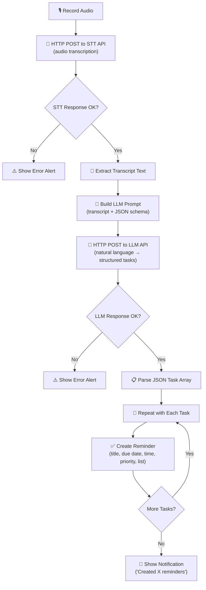

# Voice to Reminders

A voice-powered iOS Shortcut that records your speech, transcribes it, uses an LLM to parse natural language into structured tasks, and creates them as native iOS Reminders — all from a single tap.

## Why It Exists

Capturing tasks should be as fast as thinking of them. But typing out reminders with dates, times, and priorities is slow — especially when you have multiple tasks to add. You want to say "Remind me to call the dentist tomorrow at 2pm and pick up groceries on Saturday morning" and have it just happen.

This shortcut bridges the gap between natural speech and structured task data. It uses a two-stage AI pipeline — speech-to-text followed by LLM parsing — to turn a single spoken utterance into one or more fully populated iOS Reminders with titles, due dates, times, priorities, and list assignments. No third-party task app required.

## User-Facing Behavior

1. **Tap** the shortcut from your Home Screen, widget, or via Siri
2. **Speak** your tasks naturally — one task or many, with whatever date and priority language feels right
3. **Wait** a few seconds while the audio is transcribed and the LLM parses your tasks (typically 3-6 seconds total)
4. **Done** — your Reminders app now contains the new tasks with dates, times, and priorities filled in
5. **Confirmation** — a notification tells you how many reminders were created

### Real-World Examples

- **Quick task capture**: "Remind me to renew my passport next Friday" — creates one reminder due next Friday
- **Meeting follow-ups**: "After the meeting, email the proposal to Sarah by Wednesday and schedule a demo for next Monday at 10am" — creates two reminders with appropriate dates and times
- **Errands list**: "I need to pick up dry cleaning tomorrow morning, buy groceries on Saturday, and return the library books by the 15th" — creates three separate reminders
- **Priority tasks**: "Urgently fix the login bug today and update the documentation sometime this week" — creates two reminders, the first with high priority
- **Specific lists**: "Add milk, eggs, and bread to my Groceries list" — creates three reminders in the Groceries list

## Internal Flow



### Step-by-Step Breakdown

| Step | Shortcut Action | What It Does |
|------|----------------|--------------|
| 1 | **Record Audio** | Opens the iOS microphone and records until the user taps Stop |
| 2 | **Text** (x5) | Defines the STT endpoint URL, STT API key, LLM endpoint URL, LLM API key, and LLM model as text blocks |
| 3 | **Get Contents of URL** (STT) | Sends an HTTP POST with the audio file as `multipart/form-data` to the STT endpoint, with `Authorization: Bearer <key>` header |
| 4 | **Get Dictionary Value** | Parses the STT JSON response and extracts the transcript from the `text` field |
| 5 | **Text** (LLM prompt) | Constructs the LLM prompt: system instructions for JSON task extraction + the transcript |
| 6 | **Get Contents of URL** (LLM) | Sends an HTTP POST with the prompt as a JSON chat completion request to the LLM endpoint |
| 7 | **Get Dictionary Value** (x3) | Navigates the LLM response: `choices` → first item → `message` → `content`, then parses the JSON string into a dictionary and extracts the `tasks` array |
| 8 | **Repeat with Each** | Iterates over each task object in the array |
| 9 | **Get Dictionary Value** (x5) | Extracts `title`, `due_date`, `due_time`, `priority`, and `list` from each task object |
| 10 | **Add New Reminder** | Creates an iOS Reminder with the extracted title, due date, and priority |
| 11 | **End Repeat** | Closes the loop |
| 12 | **Count** | Counts how many items were in the tasks array |
| 13 | **Show Notification** | Displays a banner: "Created X reminders" |

## LLM JSON Schema

The shortcut instructs the LLM to return a JSON object with a `tasks` array. Each task has the following shape:

```json
{
  "tasks": [
    {
      "title": "Call the dentist",
      "due_date": "2025-01-15",
      "due_time": "14:00",
      "priority": "medium",
      "list": "Reminders"
    },
    {
      "title": "Pick up groceries",
      "due_date": "2025-01-18",
      "due_time": "09:00",
      "priority": "none",
      "list": "Errands"
    }
  ]
}
```

### Field Reference

| Field | Type | Required | Description |
|-------|------|----------|-------------|
| `title` | string | Yes | The task description, concise and actionable |
| `due_date` | string (ISO 8601) | No | Due date in `YYYY-MM-DD` format. Omitted if no date is mentioned. |
| `due_time` | string | No | Due time in `HH:MM` (24-hour) format. Omitted if no time is mentioned. |
| `priority` | string | No | One of `high`, `medium`, `low`, or `none`. Defaults to `none`. |
| `list` | string | No | Name of the Reminders list to add the task to. Defaults to `Reminders`. |

### LLM Prompt

The shortcut sends the following system prompt to the LLM:

```
You are a task extraction assistant. The user will give you a transcript of spoken text.
Extract all tasks or reminders mentioned and return them as a JSON object.

Today's date context will be provided so you can resolve relative dates like "tomorrow",
"next Friday", "this weekend", etc.

Return ONLY valid JSON with this exact schema:
{
  "tasks": [
    {
      "title": "string (concise task description)",
      "due_date": "YYYY-MM-DD or null if no date mentioned",
      "due_time": "HH:MM in 24h format or null if no time mentioned",
      "priority": "high|medium|low|none (default: none)",
      "list": "string (Reminders list name, default: Reminders)"
    }
  ]
}

Rules:
- Extract EVERY distinct task from the transcript
- Use concise, actionable titles (e.g., "Call dentist" not "I need to call the dentist")
- Resolve relative dates based on today's date
- "Morning" = 09:00, "afternoon" = 14:00, "evening" = 18:00, "end of day" = 17:00
- Words like "urgent", "ASAP", "important" → priority: "high"
- Words like "sometime", "whenever", "low priority" → priority: "low"
- If a specific list is mentioned (e.g., "add to my Groceries list"), use that list name
- Return ONLY the JSON object, no markdown, no explanation
```

### Example Conversion

**Spoken input:**
> "Remind me to call the dentist tomorrow at 2pm and pick up groceries on Saturday morning. Oh, and urgently fix the login bug today."

**Transcript (from STT):**
```
Remind me to call the dentist tomorrow at 2pm and pick up groceries on Saturday morning. Oh, and urgently fix the login bug today.
```

**LLM JSON output** (assuming today is 2025-01-14, Tuesday):
```json
{
  "tasks": [
    {
      "title": "Call the dentist",
      "due_date": "2025-01-15",
      "due_time": "14:00",
      "priority": "none",
      "list": "Reminders"
    },
    {
      "title": "Pick up groceries",
      "due_date": "2025-01-18",
      "due_time": "09:00",
      "priority": "none",
      "list": "Reminders"
    },
    {
      "title": "Fix the login bug",
      "due_date": "2025-01-14",
      "due_time": null,
      "priority": "high",
      "list": "Reminders"
    }
  ]
}
```

**Created Reminders:**
- "Call the dentist" — due Wed Jan 15 at 2:00 PM
- "Pick up groceries" — due Sat Jan 18 at 9:00 AM
- "Fix the login bug" — due Tue Jan 14, high priority

## Inputs

| Input | Type | Description |
|-------|------|-------------|
| Audio | Recorded audio file | Captured via the built-in "Record Audio" action in `.m4a` format |

## Outputs

| Output | Type | Description |
|--------|------|-------------|
| iOS Reminders | Reminder items | One or more reminders created in the Reminders app with titles, dates, and priorities |
| Notification | Banner | Confirmation showing how many reminders were created |

## Permissions Required

| Permission | Why |
|-----------|-----|
| **Microphone** | To record audio |
| **Network** | To send audio to the STT endpoint and transcript to the LLM endpoint |
| **Reminders** | To create reminder items in the iOS Reminders app |

## Setup

### 1. Choose Your Providers

This shortcut requires **two** API providers: one for speech-to-text (STT) and one for an LLM (to parse natural language into structured tasks). You can use the same provider for both if they offer both services.

#### STT Providers

| Provider | Endpoint | Response Field | Latency | Cost | Notes |
|----------|----------|---------------|---------|------|-------|
| **OpenAI Whisper** | `https://api.openai.com/v1/audio/transcriptions` | `text` | ~2-5s | $0.006/min | Most popular, great accuracy |
| **Groq Whisper** | `https://api.groq.com/openai/v1/audio/transcriptions` | `text` | ~0.5-1s | Free tier available | Fastest option, same API format as OpenAI |
| **Deepgram** | `https://api.deepgram.com/v1/listen` | nested | ~1-2s | Free tier available | Requires more complex response parsing |

#### LLM Providers

| Provider | Endpoint | Model | Latency | Cost | Notes |
|----------|----------|-------|---------|------|-------|
| **OpenAI** | `https://api.openai.com/v1/chat/completions` | `gpt-4o-mini` | ~1-2s | $0.15/1M input | Best balance of speed and quality |
| **Groq** | `https://api.groq.com/openai/v1/chat/completions` | `llama-3.3-70b-versatile` | ~0.3-1s | Free tier available | Fastest, great for structured extraction |
| **Anthropic** | `https://api.anthropic.com/v1/messages` | `claude-3-5-haiku-20241022` | ~1-2s | $0.25/1M input | Different request format (not OpenAI-compatible) |
| **OpenRouter** | `https://openrouter.ai/api/v1/chat/completions` | Various | Varies | Varies | Access to many models with one key |

> **Recommended combo**: Groq for both STT (whisper-large-v3) and LLM (llama-3.3-70b-versatile). Both are fast, free-tier available, and use the same API key.

### 2. Get API Keys

Sign up with your chosen providers and generate API keys:

- **OpenAI**: [platform.openai.com/api-keys](https://platform.openai.com/api-keys)
- **Groq**: [console.groq.com/keys](https://console.groq.com/keys)
- **Deepgram**: [console.deepgram.com](https://console.deepgram.com)
- **OpenRouter**: [openrouter.ai/keys](https://openrouter.ai/keys)

### 3. Install the Shortcut

Download and install the shortcut on your iOS device:

**[Install Voice to Reminders](voice-reminders.shortcut)**

> After installing, iOS will prompt you to enter your STT and LLM configuration. Fill in the endpoint URLs, API keys, and model name.

### 4. Configure

During import, you will be prompted for these values:

1. **STT API Endpoint URL** — Your speech-to-text provider's endpoint
2. **STT API Key** — Your speech-to-text API key
3. **LLM API Endpoint URL** — Your LLM provider's chat completions endpoint
4. **LLM API Key** — Your LLM API key
5. **LLM Model** — The model identifier (e.g., `llama-3.3-70b-versatile`, `gpt-4o-mini`)

### 5. Test It

Tap the shortcut and say "Remind me to test this shortcut right now." Check your Reminders app — you should see a new reminder with today's date.

## Configuration Options

| Option | Default | Description |
|--------|---------|-------------|
| `STT_ENDPOINT_URL` | *(must set)* | The HTTP endpoint to POST audio for transcription |
| `STT_API_KEY` | *(must set)* | Bearer token for the STT service |
| `LLM_ENDPOINT_URL` | *(must set)* | The HTTP endpoint for chat completions |
| `LLM_API_KEY` | *(must set)* | Bearer token for the LLM service |
| `LLM_MODEL` | `llama-3.3-70b-versatile` | LLM model identifier |
| Audio format | `.m4a` (AAC) | Recording format sent to the STT API |

## Privacy Notes

- **Audio leaves your device** and is sent to your configured STT endpoint for transcription. It is **not** processed on-device.
- **Your transcript is sent to an LLM** for parsing. The LLM receives the text of what you said in order to extract task data.
- **API keys are stored locally** inside the shortcut on your device. They are only transmitted to their respective endpoints.
- **No telemetry** — the shortcut does not phone home or send data anywhere beyond your chosen providers.
- **No storage** — the shortcut does not save recordings or transcripts. Audio exists only in memory during processing.
- **Reminders are stored locally** in the iOS Reminders app (or synced via iCloud if you have that enabled).
- Review your providers' data retention policies to understand how they handle your audio and text data.

## Known Limitations

- **OpenAI-compatible APIs only**: The LLM request uses the OpenAI chat completions format (`/v1/chat/completions`). Providers with different formats (like Anthropic's native API) require modifying the HTTP request body structure.
- **Recording length**: Limited by the iOS Shortcuts "Record Audio" action. Very long recordings may cause memory issues or STT timeouts.
- **Date resolution**: The LLM resolves relative dates ("tomorrow", "next Friday") based on the current date injected into the prompt. Accuracy depends on the LLM model's reasoning ability.
- **List matching**: The LLM may suggest a Reminders list name that does not exist on your device. iOS will fall back to the default list in that case.
- **No time zone awareness**: Times are interpreted in your device's local time zone. The LLM is not explicitly told your time zone.
- **JSON reliability**: Smaller or less capable LLMs may occasionally return malformed JSON. Use a capable model (GPT-4o-mini, Llama 3.3 70B, or better) for reliable structured output.
- **No editing**: The shortcut creates reminders but does not check for duplicates or allow editing before creation.
- **Single language**: The STT model auto-detects language, but the LLM prompt is in English. Non-English tasks will work if the LLM supports the language, but field names remain in English.

## Troubleshooting

| Problem | Likely Cause | Solution |
|---------|-------------|----------|
| "Could not connect to the server" | Wrong endpoint URL or no internet | Double-check both STT and LLM endpoint URLs. Try opening them in Safari. |
| No reminders created | LLM returned malformed JSON | Add a "Quick Look" action after the LLM response to inspect the raw output. Ensure your model supports JSON output reliably. |
| Wrong dates on reminders | LLM misinterpreted relative dates | Try a more capable model. Check that the date-injection part of the prompt is working (it includes today's date). |
| "401 Unauthorized" error | Invalid or expired API key | Regenerate your API key and update the shortcut. Remember you have two keys — check both. |
| Reminders appear in wrong list | List name does not match an existing list on your device | Create the list in Reminders first, or modify the LLM prompt to use your actual list names. |
| Only one reminder created from multiple tasks | LLM failed to separate tasks | Speak more distinctly between tasks. Use words like "and", "also", "plus" to separate them. |
| Shortcut takes very long | Slow STT or LLM endpoint | Switch to Groq for both services. Keep recordings short (under 30 seconds for task capture). |
| Garbled or inaccurate transcript | Low audio quality | Speak clearly, reduce background noise, or try a different STT model. |
