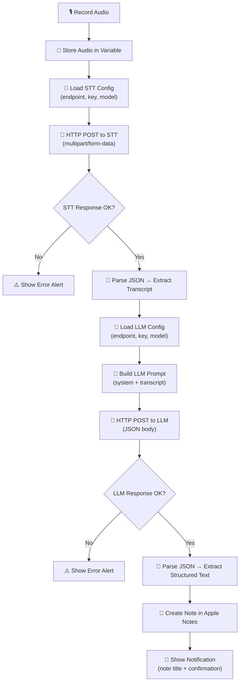

# Voice to Structured Notes

A two-stage iOS Shortcut that records your speech, transcribes it via any STT provider, then sends the transcript to an LLM to produce a clean, structured note with a title, summary, key points, and action items -- all saved directly to Apple Notes.

## Why It Exists

Voice notes are fast to capture but painful to review. You speak in stream-of-consciousness, jump between topics, circle back, say "um" a lot. The raw transcript is better than nothing, but it is not something you want to read later.

This shortcut closes the gap between **speaking** and **having a useful note**. Instead of dumping a wall of text into your notes app, it gives you a formatted document with structure: a generated title, a concise summary, extracted key points, and a list of action items pulled from what you said. Two API calls (speech-to-text, then LLM) turn messy speech into something you would actually write if you had the time.

It is provider-agnostic on both layers. Use any STT backend (OpenAI Whisper, Groq, Deepgram, local Whisper) and any LLM (OpenAI GPT, Anthropic Claude, Groq Llama, local Ollama). Swap either one without changing the shortcut's structure.

## User-Facing Behavior

1. **Tap** the shortcut from your Home Screen, widget, or via Siri
2. **Speak** -- the shortcut records audio using the iOS built-in recording action
3. **Wait** a few seconds while the audio is transcribed and the transcript is structured (typically 3-8 seconds total)
4. **Done** -- a structured note appears in Apple Notes with a title, summary, key points, and action items
5. **Notification** -- a banner confirms the note was saved and shows the generated title

### Real-World Examples

- **Meeting recap**: Record the last 2 minutes of a standup. Get a note titled "Sprint Planning - March 15" with decisions, owners, and next steps extracted automatically.
- **Brainstorm capture**: Pace around and talk through an idea. The LLM organizes your scattered thoughts into a coherent outline with grouped themes.
- **Lecture notes**: Record a key segment of a lecture. Get structured notes with main concepts, definitions, and review questions.
- **Voice journal**: Speak about your day on the walk home. Get a journal entry with highlights, reflections, and things to follow up on.
- **Errand planning**: Rattle off everything you need to do this weekend. Get a clean checklist with action items grouped by context (home, errands, calls).

## Internal Flow



### Step-by-Step Breakdown

| Step | Shortcut Action | What It Does |
|------|----------------|--------------|
| 1 | **Comment** | Marks the start of the STT configuration section |
| 2 | **Text** | Defines the STT API endpoint URL |
| 3 | **Set Variable** | Stores the STT endpoint as `stt_endpoint` |
| 4 | **Text** | Defines the STT API key |
| 5 | **Set Variable** | Stores the STT API key as `stt_api_key` |
| 6 | **Text** | Defines the STT model name (e.g., `whisper-large-v3`) |
| 7 | **Set Variable** | Stores the model as `stt_model` |
| 8 | **Comment** | Marks the start of the LLM configuration section |
| 9 | **Text** | Defines the LLM API endpoint URL |
| 10 | **Set Variable** | Stores the LLM endpoint as `llm_endpoint` |
| 11 | **Text** | Defines the LLM API key |
| 12 | **Set Variable** | Stores the LLM API key as `llm_api_key` |
| 13 | **Text** | Defines the LLM model name (e.g., `gpt-4o`) |
| 14 | **Set Variable** | Stores the model as `llm_model` |
| 15 | **Comment** | Marks the start of the recording and processing section |
| 16 | **Record Audio** | Opens the iOS microphone and records until the user taps Stop |
| 17 | **Set Variable** | Stores the recorded audio as a file variable |
| 18 | **Get Contents of URL** | HTTP POST to the STT endpoint with the audio file as `multipart/form-data` and Bearer auth |
| 19 | **Get Dictionary Value** | Parses the STT JSON response and extracts the `text` field (transcript) |
| 20 | **Set Variable** | Stores the transcript as `transcript` |
| 21 | **Text** | Constructs the LLM system prompt instructing it to structure the transcript |
| 22 | **Dictionary** | Builds the JSON request body with model, system prompt, and user message (the transcript) |
| 23 | **Get Contents of URL** | HTTP POST to the LLM endpoint with the JSON body and Bearer auth |
| 24 | **Get Dictionary Value** | Navigates the LLM response to extract the structured note content |
| 25 | **Create Note** | Creates a new note in Apple Notes with the structured content |
| 26 | **Show Notification** | Displays a banner confirming the note was saved |

## Inputs

| Input | Type | Description |
|-------|------|-------------|
| Audio | Recorded audio file | Captured via the built-in "Record Audio" action in `.m4a` format |

## Outputs

| Output | Type | Description |
|--------|------|-------------|
| Apple Note | Note | A structured note saved to the default Apple Notes folder |
| Notification | Banner | Confirmation that the note was created, showing the generated title |

## Permissions Required

| Permission | Why |
|-----------|-----|
| **Microphone** | To record audio |
| **Network** | To send audio to the STT endpoint and transcript to the LLM endpoint |
| **Notes** | To create a new note in Apple Notes |
| **Notifications** | To show a confirmation banner when complete |

## Setup

### 1. Choose Your Providers

This shortcut requires two API providers: one for speech-to-text (STT) and one for an LLM. They can be from the same vendor or different ones.

#### STT Providers

| Provider | Endpoint | Response Field | Latency | Cost | Notes |
|----------|----------|---------------|---------|------|-------|
| **OpenAI Whisper** | `https://api.openai.com/v1/audio/transcriptions` | `text` | ~2-5s | $0.006/min | Most popular, great accuracy |
| **Groq Whisper** | `https://api.groq.com/openai/v1/audio/transcriptions` | `text` | ~0.5-1s | Free tier available | Fastest option, same API format as OpenAI |
| **Deepgram** | `https://api.deepgram.com/v1/listen` | `results.channels[0]...transcript` | ~1-2s | Free tier available | Real-time capable, different response shape |
| **Local Whisper** | `http://your-server:8080/transcribe` | Varies | Depends | Free (self-hosted) | Full privacy, requires running a server |

#### LLM Providers

| Provider | Endpoint | Latency | Cost | Notes |
|----------|----------|---------|------|-------|
| **OpenAI** | `https://api.openai.com/v1/chat/completions` | ~2-5s | Varies by model | GPT-4o recommended for best structuring |
| **Anthropic** | `https://api.anthropic.com/v1/messages` | ~2-5s | Varies by model | Different request/response format (see note below) |
| **Groq** | `https://api.groq.com/openai/v1/chat/completions` | ~0.5-2s | Free tier available | Llama 3 models, fastest inference |
| **Local (Ollama)** | `http://your-server:11434/v1/chat/completions` | Depends | Free (self-hosted) | Full privacy, OpenAI-compatible API |

> **Note on Anthropic**: The Anthropic Messages API uses a different request/response format than OpenAI. The default build script targets the OpenAI-compatible chat completions format. If using Anthropic directly, you will need to adjust the request body and response parsing. Groq and Ollama both support the OpenAI format.

### 2. Get API Keys

You need up to two API keys (one if you use the same provider for both):

- **OpenAI**: [platform.openai.com/api-keys](https://platform.openai.com/api-keys)
- **Groq**: [console.groq.com/keys](https://console.groq.com/keys)
- **Deepgram**: [console.deepgram.com](https://console.deepgram.com)
- **Anthropic**: [console.anthropic.com/settings/keys](https://console.anthropic.com/settings/keys)

### 3. Install the Shortcut

Download and install the shortcut on your iOS device:

**[Install Voice to Structured Notes](voice-structured-notes.shortcut)**

> After installing, iOS will prompt you to fill in your API configuration. Enter your endpoints, API keys, and model names when prompted.

### 4. Test It

Tap the shortcut, say a few sentences about a topic, and check Apple Notes. You should see a new note with a title, summary, key points, and any action items extracted from your speech.

## Configuration Options

| Option | Default | Description |
|--------|---------|-------------|
| `STT_ENDPOINT` | `https://api.groq.com/openai/v1/audio/transcriptions` | The HTTP endpoint to POST audio to for transcription |
| `STT_API_KEY` | *(must set)* | Bearer token for the STT provider |
| `STT_MODEL` | `whisper-large-v3` | STT model identifier |
| `LLM_ENDPOINT` | `https://api.groq.com/openai/v1/chat/completions` | The HTTP endpoint to POST the transcript to for structuring |
| `LLM_API_KEY` | *(must set)* | Bearer token for the LLM provider |
| `LLM_MODEL` | `llama-3.3-70b-versatile` | LLM model identifier |

## Example LLM Prompt and Response

### System Prompt (built into the shortcut)

```
You are a note-taking assistant. You will receive a raw transcript of spoken audio. Your job is to transform it into a well-structured note.

Output the note in this exact format:

# [Generated Title]

## Summary
[2-3 sentence summary of the main topic]

## Key Points
- [Key point 1]
- [Key point 2]
- [Key point 3]
...

## Action Items
- [ ] [Action item 1]
- [ ] [Action item 2]
...

If there are no action items, omit the Action Items section entirely.
Keep the language natural and concise. Do not add information that was not in the transcript.
```

### Example: Meeting Recap

**Raw transcript (sent as user message):**
```
OK so we just finished the sprint review. The main thing is the new checkout flow is done, Sarah demoed it and it looks really good. Um, the API latency issue that Jake was working on, he got it down from 800 milliseconds to about 200 which is a huge improvement. We still need to fix the mobile layout on the settings page, that's been pushed to next sprint. Oh and we decided to move the launch date to April 3rd instead of March 28th because we want more time for QA. I need to update the roadmap doc and tell the marketing team about the new date. Also remind me to book the conference room for Thursday's retro.
```

**Structured note (LLM response, saved to Apple Notes):**
```
# Sprint Review Recap

## Summary
The sprint review covered the completed checkout flow, significant API performance improvements, and a decision to push the launch date to April 3rd to allow more QA time. The mobile settings layout fix was deferred to the next sprint.

## Key Points
- New checkout flow is complete -- Sarah demoed it successfully
- API latency reduced from 800ms to ~200ms by Jake (major improvement)
- Mobile layout fix for settings page pushed to next sprint
- Launch date moved from March 28 to April 3 for additional QA time

## Action Items
- [ ] Update the roadmap document with the new April 3 launch date
- [ ] Notify the marketing team about the revised launch date
- [ ] Book the conference room for Thursday's retrospective
```

### Example: Brainstorm Capture

**Raw transcript:**
```
So I've been thinking about the onboarding flow. Right now it's like five screens and people drop off on screen three which is where we ask for the company name and team size. I wonder if we could just skip that entirely and ask later, like after they've actually seen the product. Or maybe we could infer the company from their email domain. Another idea is to just make it two screens, name and email on the first, then go straight to the dashboard with a getting started checklist. Yeah I like that better. We should prototype that. Oh we could also add a progress bar so people know how close they are to being done.
```

**Structured note:**
```
# Onboarding Flow Redesign Ideas

## Summary
Brainstorm session on reducing onboarding drop-off, currently happening at screen 3 (company/team info). Several approaches considered, with a preference for a simplified two-screen flow leading directly to the dashboard.

## Key Points
- Current onboarding is 5 screens; significant drop-off at screen 3 (company name/team size)
- Option A: Defer company info collection until after the user has seen the product
- Option B: Infer company name from email domain automatically
- Option C (preferred): Reduce to 2 screens -- name/email, then straight to dashboard with a getting started checklist
- A progress bar could help reduce perceived friction on any flow

## Action Items
- [ ] Prototype the two-screen onboarding flow with getting started checklist
```

## Privacy Notes

- **Two external API calls**: Your audio is sent to the STT provider, and the resulting transcript text is sent to the LLM provider. Both calls transmit data off-device.
- **Audio goes to your STT provider** -- it is not processed on-device. Review your STT provider's data retention policy.
- **Your transcript goes to your LLM provider** -- the full text of what you said is sent as a prompt. Review your LLM provider's data retention and training policies.
- **API keys are stored locally** inside the shortcut on your device. They are only transmitted to their respective endpoints.
- **No telemetry** -- the shortcut does not phone home or send data anywhere beyond your two chosen providers.
- **The structured note stays on-device** in Apple Notes (synced via iCloud if you have Notes sync enabled).
- If you use **local servers** for both STT and LLM (e.g., local Whisper + Ollama), no data ever leaves your network.

## Known Limitations

- **Recording length**: Limited by the iOS Shortcuts "Record Audio" action. Very long recordings may cause memory issues or exceed STT file size limits.
- **File size**: Some STT providers cap upload size (OpenAI Whisper: 25 MB, roughly 90+ minutes of speech audio).
- **Two sequential network calls**: Total latency is the sum of STT + LLM response times. On slow connections, this can take 10+ seconds.
- **LLM output format**: The shortcut expects plain text from the LLM. If the LLM returns markdown with complex formatting, Apple Notes may not render it perfectly.
- **No streaming**: Both API calls are synchronous. The shortcut waits for each to complete before proceeding.
- **OpenAI-compatible format assumed**: The LLM request body uses the OpenAI chat completions format. Providers with different APIs (like Anthropic's native format) require manual adjustment.
- **Single note folder**: Notes are saved to the default Apple Notes folder. There is no UI for choosing a subfolder (though you can change this in the shortcut editor).
- **Language**: The system prompt is in English and instructs the LLM to output in English. For other languages, modify the system prompt text block.

## Troubleshooting

| Problem | Likely Cause | Solution |
|---------|-------------|----------|
| "Could not connect to the server" on first call | Wrong STT endpoint URL or no internet | Double-check the STT URL. Try opening it in Safari to verify connectivity. |
| "Could not connect to the server" on second call | Wrong LLM endpoint URL | Verify the LLM endpoint. STT worked, so your network is fine -- the URL is likely wrong. |
| "401 Unauthorized" on STT call | Invalid or expired STT API key | Regenerate your STT API key and update the shortcut. |
| "401 Unauthorized" on LLM call | Invalid or expired LLM API key | Regenerate your LLM API key and update the shortcut. |
| Empty or garbled transcript | Low audio quality or wrong STT model | Speak clearly, reduce background noise, or try `whisper-large-v3`. |
| Note created but content is raw/unstructured | LLM not structuring correctly | Check that the LLM model supports instruction following. Try a stronger model (e.g., GPT-4o, Llama 3.3 70B). |
| Note not appearing in Apple Notes | Notes permission not granted | Go to Settings > Shortcuts > Voice to Structured Notes and enable Notes access. |
| Shortcut hangs for a long time | Large audio file or slow provider | Try shorter recordings. Consider using Groq for both STT and LLM for fastest results. |
| "The file is too large" | STT provider file size limit exceeded | Keep recordings under ~10 minutes for reliable uploads. |
| LLM returns extra text outside the format | Model not following the system prompt closely | Add "Do not include any text outside the specified format" to the system prompt, or switch to a more instruction-following model. |
