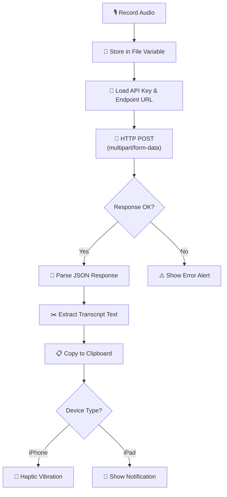

# Universal Transcribe

A provider-agnostic iOS Shortcut that records audio on your device, sends it to any speech-to-text service, and copies the transcript to your clipboard. One tap, any provider, instant results.

## Why It Exists

Transcription is one of the most useful things you can do with a phone. You want to dictate a note, capture an idea, transcribe a meeting snippet, or turn speech into text you can paste anywhere. But every STT provider has its own app, its own workflow, and its own lock-in.

This shortcut gives you a **single tap-to-transcribe flow** that works with whichever backend you prefer — OpenAI Whisper, Groq, Deepgram, a local server, or anything else that accepts audio over HTTP and returns text.

## User-Facing Behavior

1. **Tap** the shortcut from your Home Screen, widget, Share Sheet, or via Siri
2. **Speak** — the shortcut records audio using iOS's built-in recording action
3. **Wait** a moment while the audio is uploaded and transcribed (usually 1-3 seconds)
4. **Paste** — the transcript is already on your clipboard
5. **Confirmation** — a haptic vibration (iPhone) or banner notification (iPad) tells you it's ready

### Real-World Examples

- **Quick note capture**: Tap, say "Remember to pick up groceries and call the dentist", paste into Reminders or Notes
- **Meeting transcription**: Record a key point during a meeting, paste it into your notes doc
- **Hands-free texting**: Dictate a message, paste it into any messaging app with higher accuracy than built-in dictation
- **Voice journaling**: Speak your thoughts, paste into Day One or Obsidian
- **Accessibility**: Use speech-to-text as an input method anywhere iOS supports pasting

## Internal Flow



### Step-by-Step Breakdown

| Step | Shortcut Action | What It Does |
|------|----------------|--------------|
| 1 | **Record Audio** | Opens the iOS microphone and records until the user taps Stop |
| 2 | **Set Variable** | Stores the recorded audio as a file variable (`.m4a` by default) |
| 3 | **Text** (x2) | Defines the API endpoint URL and API key as text blocks |
| 4 | **Get Contents of URL** | Sends an HTTP POST with the audio file as `multipart/form-data`, with `Authorization: Bearer <key>` header |
| 5 | **Get Dictionary Value** | Parses the JSON response and extracts the transcript field (e.g., `text`) |
| 6 | **Copy to Clipboard** | Places the extracted text on the system clipboard |
| 7 | **If / Otherwise** | Checks device model: vibrates on iPhone, shows a notification on iPad |

## Inputs

| Input | Type | Description |
|-------|------|-------------|
| Audio | Recorded audio file | Captured via the built-in "Record Audio" action in `.m4a` format |

## Outputs

| Output | Type | Description |
|--------|------|-------------|
| Clipboard | Text | The transcribed text, ready to paste into any app |

## Permissions Required

| Permission | Why |
|-----------|-----|
| **Microphone** | To record audio |
| **Network** | To send audio to the transcription endpoint |
| **Clipboard** | To copy the result (auto-granted in Shortcuts) |

## Setup

### 1. Choose a Provider

This shortcut works with any HTTP-based transcription endpoint. Here are tested providers with their trade-offs:

| Provider | Endpoint | Response Field | Latency | Cost | Notes |
|----------|----------|---------------|---------|------|-------|
| **OpenAI Whisper** | `https://api.openai.com/v1/audio/transcriptions` | `text` | ~2-5s | $0.006/min | Most popular, great accuracy |
| **Groq Whisper** | `https://api.groq.com/openai/v1/audio/transcriptions` | `text` | ~0.5-1s | Free tier available | Fastest option, same API format as OpenAI |
| **Deepgram** | `https://api.deepgram.com/v1/listen` | `results.channels[0].alternatives[0].transcript` | ~1-2s | Free tier available | Real-time capable, different response shape |
| **Local Whisper** | `http://your-server:8080/transcribe` | Varies | Depends | Free (self-hosted) | Full privacy, requires running a server |

### 2. Get an API Key

Sign up with your chosen provider and generate an API key:

- **OpenAI**: [platform.openai.com/api-keys](https://platform.openai.com/api-keys)
- **Groq**: [console.groq.com/keys](https://console.groq.com/keys)
- **Deepgram**: [console.deepgram.com](https://console.deepgram.com)

### 3. Install the Shortcut

Download and install the shortcut on your iOS device:

**[Install Universal Transcribe](universal-transcribe.shortcut)**

> After installing, iOS will prompt you to review the shortcut's actions. This is normal — review and tap "Add Shortcut."

### 4. Configure

Open the shortcut in edit mode and update these text blocks at the top:

1. **API Endpoint URL** — Paste your provider's transcription endpoint
2. **API Key** — Paste your API key (stored locally, never shared beyond your chosen endpoint)
3. **Model** (optional) — e.g., `whisper-large-v3` for Groq, `whisper-1` for OpenAI

### 5. Test It

Tap the shortcut, say something, and check your clipboard. If it worked, you're done!

## Configuration Options

| Option | Default | Description |
|--------|---------|-------------|
| `ENDPOINT_URL` | *(must set)* | The HTTP endpoint to POST audio to |
| `API_KEY` | *(must set)* | Bearer token for authentication |
| `MODEL` | `whisper-large-v3` | Model identifier (provider-dependent) |
| `RESPONSE_FIELD` | `text` | JSON key containing the transcript |
| Audio format | `.m4a` (AAC) | Recording format sent to the API |

## Example API Interactions

### OpenAI / Groq (identical format)

**Request:**
```
POST /v1/audio/transcriptions
Authorization: Bearer sk-your-api-key
Content-Type: multipart/form-data

file: <recorded-audio.m4a>
model: whisper-large-v3
```

**Response:**
```json
{
  "text": "This is the transcribed text from the audio recording."
}
```

The shortcut extracts the `text` field directly.

### Deepgram

**Request:**
```
POST /v1/listen?model=nova-2
Authorization: Token your-api-key
Content-Type: audio/m4a

<raw audio bytes>
```

**Response:**
```json
{
  "results": {
    "channels": [
      {
        "alternatives": [
          {
            "transcript": "This is the transcribed text from the audio recording.",
            "confidence": 0.98
          }
        ]
      }
    ]
  }
}
```

For Deepgram, the shortcut needs to navigate: `results` → `channels` → first item → `alternatives` → first item → `transcript`. This requires chaining multiple "Get Dictionary Value" actions.

## Privacy Notes

- **Audio leaves your device** and is sent to whichever transcription endpoint you configure. It is **not** processed on-device.
- Your **API key is stored locally** inside the shortcut on your device. It is only transmitted to the endpoint you configure.
- **No telemetry** — the shortcut does not phone home or send data anywhere beyond your chosen provider.
- **No storage** — the shortcut does not save recordings. Audio exists only in memory during the transcription request.
- If you use a **local server**, audio never leaves your network.
- Review your provider's data retention policy to understand how long they keep your audio.

## Known Limitations

- **Recording length**: Limited by the iOS Shortcuts "Record Audio" action (no hard limit, but very long recordings may cause memory issues).
- **File size**: Some providers cap upload size (OpenAI Whisper: 25 MB, roughly 90+ minutes of speech audio).
- **Nested response fields**: Providers like Deepgram return deeply nested JSON. The shortcut's "Get Dictionary Value" chain must match your provider's response shape.
- **No streaming**: The full audio is uploaded after recording finishes. There is no live/streaming transcription.
- **Language detection**: The shortcut relies on the provider's auto-detection. There is no UI to select a language (though you could add a `language` parameter to the API call).
- **No punctuation control**: Punctuation depends on the provider's model. Most modern models (Whisper, Nova-2) add punctuation automatically.

## Troubleshooting

| Problem | Likely Cause | Solution |
|---------|-------------|----------|
| "Could not connect to the server" | Wrong endpoint URL or no internet | Double-check the URL. Try opening it in Safari to verify connectivity. |
| Empty clipboard after running | Response field path doesn't match | Check your provider's actual JSON response shape. Use the "Quick Look" action before "Copy to Clipboard" to debug. |
| "401 Unauthorized" or auth error | Invalid or expired API key | Regenerate your API key and update the shortcut. |
| Garbled or inaccurate transcript | Low audio quality or wrong model | Speak clearly, reduce background noise, or try a different model. |
| Shortcut hangs or takes very long | Large audio file or slow endpoint | Try shorter recordings. Check your network speed. Consider switching to Groq for faster inference. |
| "The file is too large" | Provider file size limit exceeded | Keep recordings under ~10 minutes for reliable uploads. Split longer recordings. |
